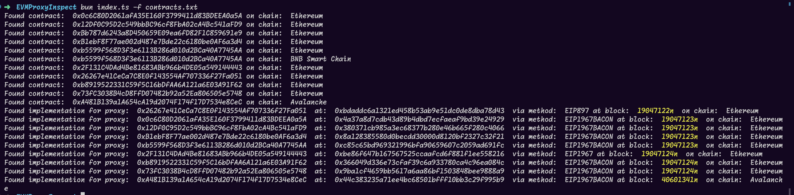
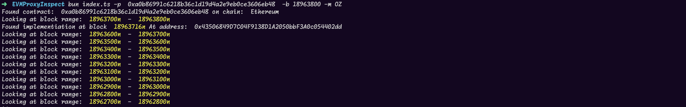

# Multi-Chain EVM Proxy Detection Tool

This is PoC for detecting EVM Proxies on multiple chains. it shows you how tools like etherscan detect proxies and how you can do it yourself. it support multiple chains and multiple proxy patterns.


## supported patterns:

- EIP-1967 Beacon Proxy
- EIP-1167 Minimal Proxy Pattern
- EIP-1822 Universal Upgradeable Proxy Pattern
- EIP-1967 Beacon Proxy
- EIP-897 Delegate Proxy Pattern
- OpenZeppelin Transparent Proxy
- Gnosis Safe Proxy
- Compound Comptroller Proxy


## supported chains:

- Ethereum
- Binance Smart Chain
- Polygon
- polygonZkEvm
- Optimism
- opBNB
- Gnosis/xDAI
- Fantom
- Avalanche
- Arbitrum
- Optimism
- Base
- zkSync
- Linea
- Holesky
- Kava


## Features
- Automatic detection of proxy patterns
- Automatic detection of chains
- Multiple chains
- Multiple proxy patterns
- Historical retrieval


## Usage
To install dependencies:

```bash
bun install
```

To run:

Make a file with one address per line

```bash
bun index.ts -f contracts.txt
```


if you want previous / historical data. 


```bash 

bun index.ts -p  proxy -b startBlock -m Method
```
example : 

```bash
bun index.ts -p  0xa0b86991c6218b36c1d19d4a2e9eb0ce3606eb48  -b 18963800 -m OZ

```




* you can get the method via previous file method


To test :

need timeout because we are testing with live network

```bash
bun test --timeout 1000000
```
### limitations
- Doesn't support all proxy patterns in existence
- No concurrency support to not exhaust the public nodes
- No IPC support as it's not supported by Viem yet

### Credits:
[evm-proxy-detection](https://github.com/gnosis/evm-proxy-detection)

